# Atividade individual - Tema; Base de Dados Animais - ETAPA 1

## 1.Selecione todos os animais

Script SQL:
[SQL](2023-10-23%20Petshop.sql)

## 2.Selecione todos os animais que pesam menos que 13.1

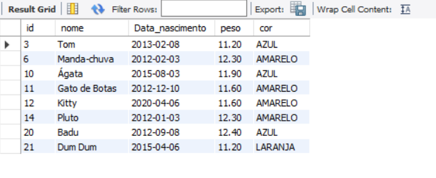

Script SQL:
[SQL](2023-10-23%20Petshop%202.sql)

## 3.Selecione todos nasceram entre fevereiro e dezembro de 2015

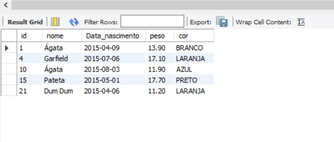

Script SQL:
[SQL](2023-10-23%20Petshop%203.sql)

## 4.Selecione todos os animais brancos que pesam menos que 15.0

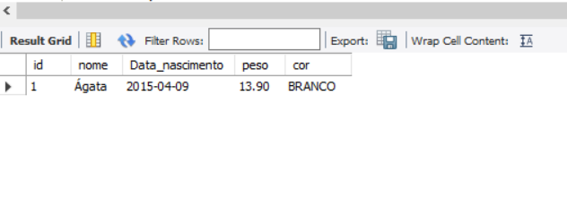

Script SQL:
[SQL](2023-10-23%20Petshop%204.sql)

## 5.Selecione nome, cor e peso de todos cujo nome comece com ’B’

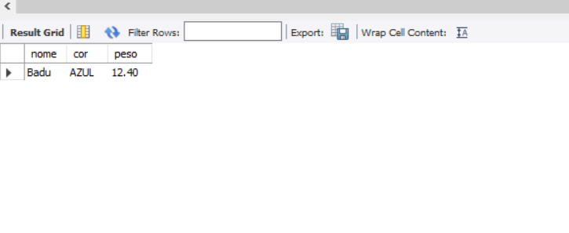

Script SQL:
[SQL](2023-10-23%20Petshop%205.sql)

## 6.Selecione nome, cor e peso de todos com cor vermelha, amarela, marrom e laranja
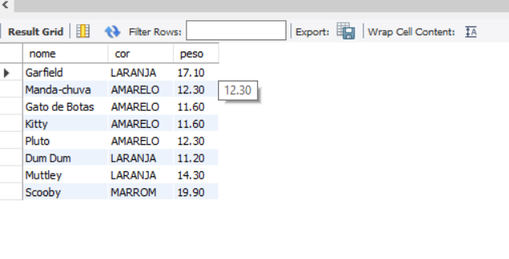

Script SQL:
[SQL](2023-10-23%20Petshop%206.sql)

## 7.Selecione nome, cor, data de nascimento e peso de todos ordenados pelos mais jovens
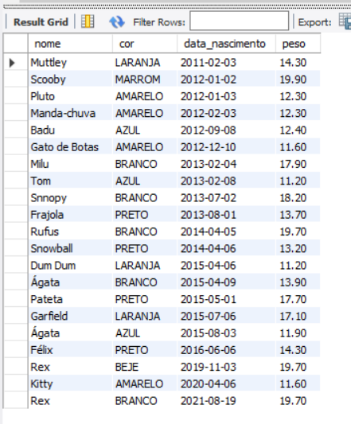

Script SQL:
[SQL](2023-10-23%20Petshop%207.sql)

## 8.Selecione todos os animais cujo nome comece com 'C' e não sejam brancos
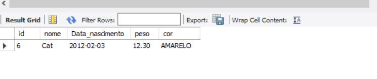

Script SQL:
[SQL](2023-10-23%20Petshop%208.sql)

## 9.Selecione todos os animais cujo nome contenha 'ba'
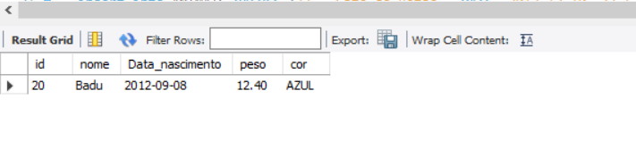

Script SQL:
[SQL](2023-10-23%20Petshop%209.sql)

## 10.Selecione todos os animais com peso entre 13.0 à 15.0
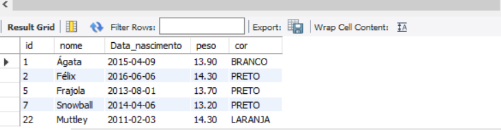

Script SQL:
[SQL](2023-10-23%20Petshop%2010.sql)

## 11.Selecione todos os animais que o peso não seja maior que 30, com cor amarelo ou roxo e nascidos depois de 2012
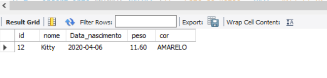

Script SQL:
[SQL](2023-10-23%20Petshop%2011.sql)

## 12.(Desafio) Selecione todos os capricornianos
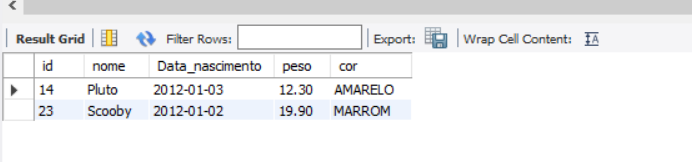

Script SQL:
[SQL](2023-10-23%20Petshop%2012.sql)

## 13.(Desafio) Selecione todos os animais com nome formado por mais de uma palavra.
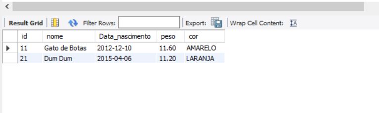

Script SQL:
[SQL](2023-10-23%20Petshop%2013.sql)

# Atividade individual - Tema; Base de Dados Animais - ETAPA 2

## 1. Crie um banco de dados para armazenar dados de Animais e Espécies. Um animal tem seu nome, data_nasc e peso. Uma espécie tem um nome e uma descrição.
  Faça a modelagem relacional, DER.
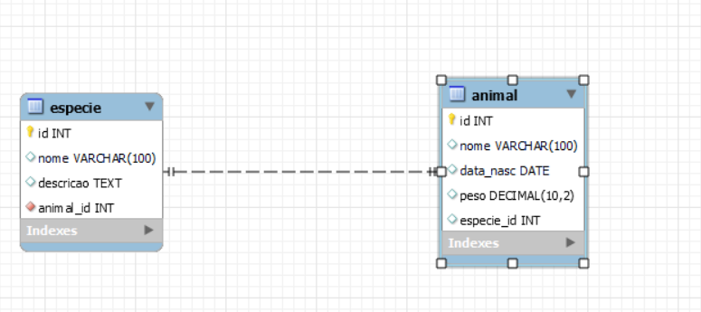

Tabela:

Script SQL:
[SQL](Animais%20e%20Especies%20-%20Etapa%202%20%20SQL%202023-10-25.sql)

