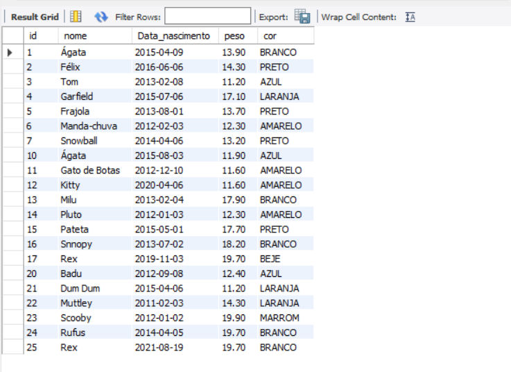

# Atividade individual - Tema; Base de Dados Animais - ETAPA 1

## 1.Selecione todos os animais

Script SQL:
[SQL](2023-10-23%20Petshop.sql)

## 2.Selecione todos os animais que pesam menos que 13.1

Script SQL:
[SQL](2023-10-23%20Petshop%202.sql)

## 3.Selecione todos nasceram entre fevereiro e dezembro de 2015

Script SQL:
[SQL](2023-10-23%20Petshop%203.sql)

## 4.Selecione todos os animais brancos que pesam menos que 15.0

Script SQL:
[SQL](2023-10-23%20Petshop%204.sql)

## 5.Selecione nome, cor e peso de todos cujo nome comece com ’B’

Script SQL:
[SQL](2023-10-23%20Petshop%205.sql)

